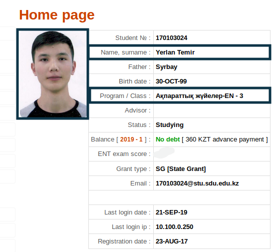

<!-- ABOUT THE PROJECT -->
## SDUdent telegram bot

    

This is self learning project aimed to make life of students of my university easier. Bot solves problems that I met during my student life. It has 2 main functionalities:

1. Notify about new grades

	 **Problem**:After passing midterm exams students everytime enters to
	 [portal](https://my.sdu.edu.kz/) to check, if there is new grade or not

	 **Solution**: Get student's authorization data(student number & password) , parse his/her grades data from portal, save it in database, continuously parse it and check for difference with grades in database,if there is a difference,tell him/her, update grades in database each time .

	 **Pseudocode:**

	>
	>     while True:
	> 	     for user in database.users:
	> 	         new_grades = get_grades_from_portal(user['username'],user['password'])
	> 	         old_grades = user['semester_data']
	> 	         difference = old_grades - new_grades
	> 	         if difference:
	> 	             notify_user(chat_id = user['chat']
	> 	             update_grade_in_database()
	>

2. Find sdudent by photo

 	 **Problem**: You liked/need someone but don't know his/her name and program,but have a photo?

	 **Solution**: Use pretrained deep-learning model to get feature vector of user photo. User photo can be found in portal .

	 This is how our portal looks like,from this page get user's photo,full name,program . Pass user's photo through pretrained model and get feature vector , data(feature_vector,full_name,program) in database.

     

        
     

	 When another user calls `/find_user` command and send photo, get feature vector of sent photo and compare with all other user's photo's feature vector by cosine similarity
	 

	    
	

	  **Pseudocode:**

       photo = user.message.photo.get_file()
       current_feature_vector = pretrained_model(photo)
       #shape = [1,512]
       max_sim = 0
       for user in database.users:
            similarity = cos_sim(current_feature_vector,user['feature']
	    if max_sum < similarity:
	        max_sim = similarity

        send message about user with highest similarity

## Built With

 - [Python-telegram-bot](https://github.com/python-telegram-bot/python-telegram-bot)
 - [MongoDB](https://www.mongodb.com/) ,[Pymongo](https://api.mongodb.com/python/current/)
 - [Pytorch](https://pytorch.org/)

 <!-- CONTRIBUTING -->
## Contributing

Contributions are what make the open source community such an amazing place to be learn, inspire, and create. Any contributions you make are **greatly appreciated**.

1. Fork the Project
2. Create your Feature Branch (`git checkout -b feature/AmazingFeature`)
3. Commit your Changes (`git commit -m 'Add some AmazingFeature'`)
4. Push to the Branch (`git push origin feature/AmazingFeature`)
5. Open a Pull Request

<!-- ACKNOWLEDGEMENTS -->
## Acknowledgements
* [Face recognition library](https://github.com/ZhaoJ9014/face.evoLVe.PyTorch/commits/master)
* [PythonTelegramBot](https://github.com/python-telegram-bot/python-telegram-bot)

## Help, feedback or suggestions?

Feel free to contact me on [Telegram](https://t.me/YerlanTemir) for discussions, news & announcements about bot & other projects.

